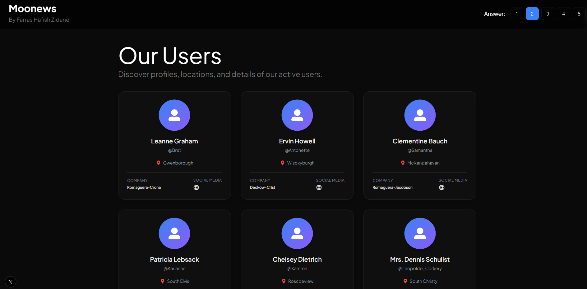

# Next.js Kencana Technical Assessment

A simple web application built with **Next.js App Router** demonstrating Static Site Generation (SSG), API Routes, responsive UI, image optimization, pagination, and form handling. This project intended as technical test for frontend staff position recruitment at Mulya Kencana Metalindo

---

## 📸 Demo, web & Screenshots
Web: https://moonewsapp.vercel.app/

Live Demo: https://drive.google.com/file/d/1M9AT1EbK4GFIwLsbP7Ffhl__owkQJ8C7/view?usp=sharing



---

## 🚀 Features

- ✅ Built with Next.js App Router
- ✅ Static Site Generation (SSG)
- ✅ Dynamic routing with pagination
- ✅ Responsive layout
- ✅ Responsive navigation with hamburger menu
- ✅ Optimized images using `next/image`
- ✅ Form handling using React state
- ✅ Local API Route
- ✅ CSS Modules styling
- ✅ Fetch data from JSONPlaceholder API
- ✅ Author name mapping from User API

---

## 📂 Project Structure

```text
app/
├── article/
│   └── page/
│       └── [pageNum]/
├── api/
│   └── products/
├── form/
├── images/
├── layout.tsx
└── page.tsx

components/
├── ArticleCard/
├── Layout/
├── Navbar/
└── Typography/

constant/
├── navigation.items.ts
└── pictures.ts

data/
└── products.json

public/

types/
└── index.ts
```

---

## 🛠️ Tech Stack

- Next.js 15
- React
- TypeScript
- CSS Modules

---

## 📦 Installation

Clone the repository

```bash
git clone <repository-url>
```

Move into the project

```bash
cd <project-name>
```

Install dependencies

```bash
npm install
```

Run development server

```bash
npm run dev
```

Open

```
http://localhost:3000
```

---

## 📝 Implemented Tasks

### ✅ Task 1 — Static Site Generation

- Implemented using App Router
- Uses `generateStaticParams()`
- Paginated article pages
- Static HTML generated during build

---

### ✅ Task 2 — Image Optimization

- Uses `next/image`
- Responsive image gallery
- Automatic optimization
- Lazy loading

---

### ✅ Task 3 — API Route

#### Notes
This Project uses app router, so it can't implement api in pages/api/products.js, rather app router uses app/api/products/route.ts.

---

Created an API endpoint using Route Handlers.

```
GET /api/products
```

Returns products from

```
data/products.json
```

Example response

```json
[
  {
    "id": 1,
    "name": "AuraSync Wireless Earbuds",
    "description": "True wireless earbuds with active noise cancellation and a 24-hour charging case.",
    "price": 89.99,
    "category": "Audio",
    "stock": 150,
    "rating": 4.5
  }
]
```

---

### ✅ Task 4 — Form Handling

Simple form containing

- Name
- Email
- Password

Submitted values are displayed below the form without reloading the page.

---

### ✅ Task 5 — Responsive Design

Responsive support for

- Desktop
- Tablet
- Mobile

Includes

- Responsive Grid
- Responsive Navbar
- Hamburger Menu
- Responsive Pagination
- Responsive Forms

---

## 📜 Available Scripts

Development

```bash
npm run dev
```

Production Build

```bash
npm run build
```

Start Production Server

```bash
npm run start
```

Lint

```bash
npm run lint
```

---

## 👤 Author

**Farras Hafish Zidane**

GitHub:
https://github.com/Farras07

LinkedIn:
https://linkedin.com/in/farrashafishz

---